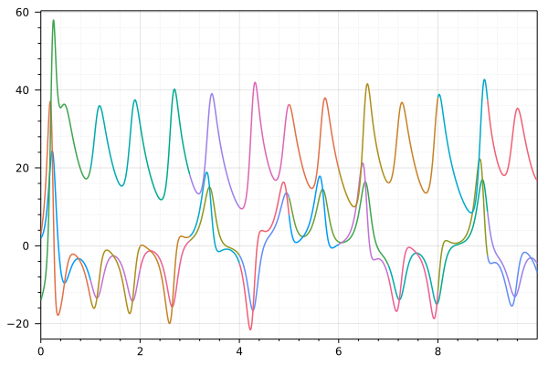

# TimeParallel.jl

A Julia package implementing time-parallel methods.

[](https://giancarloantonucci.github.io/TimeParallel.jl/stable) [](https://giancarloantonucci.github.io/TimeParallel.jl/dev) [](https://github.com/giancarloantonucci/TimeParallel.jl/actions) [](https://codecov.io/gh/giancarloantonucci/TimeParallel.jl)

## Installation

TimeParallel is a [registered package](https://juliahub.com/ui/Search?q=TimeParallel&type=packages) compatible with Julia v1.0 and above. From the Julia REPL,

```julia
]add TimeParallel
```

Below is a brief introduction, but read the [documentation](https://giancarloantonucci.github.io/TimeParallel.jl/dev) for a complete overview of this package.

## Usage

```julia
using RungeKutta, TimeParallel
using Plots, LaTeXStrings

u0 = [2.0, 3.0, -14.0]
problem = Lorenz(u0, 0.0, 10.0)
solver = Parareal(RK4(h = 1e-3), RK4(h = 1e-1), P = 10)
solution = solve(problem, solver)
plot(solution, xlabel = L"t", label = [L"x" L"y" L"z"])
```



## Available methods

`TimeParallel` currently supports only `Parareal`.
