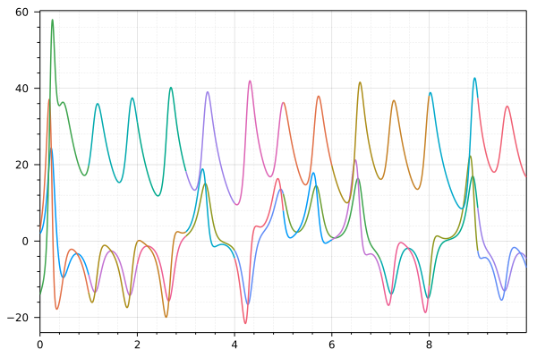

# NSDETimeParallel.jl

A Julia package implementing time-parallel methods.

[](https://giancarloantonucci.github.io/NSDETimeParallel.jl/dev)  

## Installation

<!-- This package is a [registered package](https://juliahub.com/ui/Search?q=NSDETimeParallel&type=packages) compatible with Julia v1.6 and above. From the Julia REPL,

```
]add NSDETimeParallel
``` -->

This package is compatible with Julia v1.6 and above. From the Julia REPL,

```
]add https://github.com/giancarloantonucci/NSDETimeParallel.jl
```

Read the [documentation](https://giancarloantonucci.github.io/NSDETimeParallel.jl/dev) for a complete overview of this package.

## Usage

```julia
using NSDERungeKutta, NSDETimeParallel
using Plots, LaTeXStrings

u0 = [2.0, 3.0, -14.0]
problem = Lorenz(u0, 0.0, 10.0)
parareal = Parareal(RK4(h = 1e-3), RK4(h = 1e-1);
                    parameters = PararealParameters(N = 10),
                    tolerance = Tolerance(ϵ = 1e-8))
solution = solve(problem, parareal)
plot(solution, xlabel = L"t", label = [L"x" L"y" L"z"])
```



`solution.errors` holds the error per Parareal iteration; `solution.lastiterate` holds the fine chunk solutions.

Choosing between the error functions ψ₁ and ψ₂ — and picking the weight `w` for the latter — decides what "converged" means and what it costs; see the *Choosing the convergence criterion* page of the docs before running long chaotic spans.

## Execution backends

The Parareal algorithm is written once; four interchangeable backends run its fine sweep, and a fifth is a documented semantic variant. Pick one with `mode` or `backend`:

```julia
solution = solve(problem, parareal)                        # SerialBackend (default)
solution = solve(problem, parareal; mode = "THREADS")      # or backend = ThreadsBackend()
```

- **`SerialBackend`** — everything in the calling task; the reference the other backends must agree with, bit for bit.
- **`ThreadsBackend`** — fine chunks over `Threads.@threads` in shared memory. Start Julia with `--threads=N`.
- **`DistributedBackend`** — fine chunks over `pmap` on the default worker pool; the result does not depend on the worker count. Load the packages on the workers first: `@everywhere using NSDETimeParallel, NSDERungeKutta`.
- **`MPIBackend`** — SPMD, one rank per chunk, all hand-offs through memory. Needs `MPI.Init()` and `mpiexec`; see `test/mpi/` for the recipe.
- **`PipelinedMPIBackend`** (`mode = "PIPELINED"`) — the Aubanel-scheduled SPMD variant: no root, the serial coarse chain passed rank to rank and hidden behind fine work, FRONTIER convergence (per-boundary stagnation ≤ ϵ; the global ψ is ignored, with a warning). Judge it against `theoretical_speedup(K, N, ζ; estimate = :aubanel)`, and see the Backends page of the docs for what the variant preserves and what it trades.

Disk is used only for the opt-in `saveiterates` history under MPI.

`theoretical_speedup(K, N, ζ)` gives Parareal's own speed-up ceiling for a measured coarse/fine cost ratio ζ; `benchmark/scaling.jl` measures ζ and judges the real speed-up against that ceiling.

## Available methods

This package currently supports only `Parareal`.
