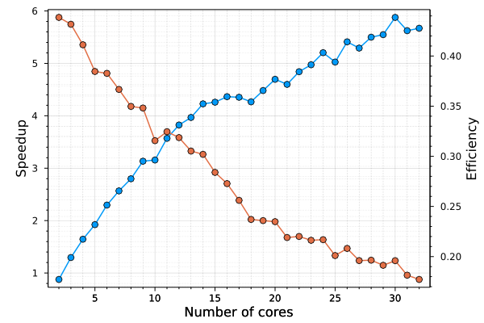

# TimeParallel

A Julia package implementing time-parallel methods.

[](https://antonuccig.github.io/TimeParallel.jl/stable) [](https://antonuccig.github.io/TimeParallel.jl/dev) [](https://github.com/antonuccig/TimeParallel.jl/actions) [](https://codecov.io/gh/antonuccig/TimeParallel.jl)

## Installation

`TimeParallel` is compatible with Julia `v1.0` and above. From the Julia REPL,

```julia
]add TimeParallel
```

## Usage

### Serial Mode (Default)

```julia
using RungeKutta
using TimeParallel
using Plots

u0 = [2.0, 3.0, -14.0]
tspan = (0.0, 1.0)
problem = Lorenz(u0, tspan)
finesolver = RK4(h = 1e-3)
coarsolver = RK4(h = 1e-1)
solver = Parareal(finesolver, coarsolver, P = 10)
solution = solve(problem, solver)
plot(solution)
# savefig("lorenz.svg")
```


### Distributed Mode

```julia
using Distributed
using Hwloc
addprocs(num_physical_cores() - nprocs()) # 36 here
```

```julia
@everywhere begin
    using Revise
    using RungeKutta
    using TimeParallel
end
using Plots
using BenchmarkTools

u0 = [2.0, 3.0, -14.0]
tspan = (0.0, 10.0)
problem = Lorenz(u0, tspan)
finesolver = RK4(h = 1e-4)
coarsolver = RK4(h = 1e-2)

Np = 1:32
tₛ = zeros(length(Np))
tₚ = zeros(length(Np))
for (i, p) in enumerate(Np)
    solver = Parareal(finesolver, coarsolver, 𝜑 = 𝜑₂, P = p)
    tₛ[i] = @belapsed solve($problem, $solver, mode = "SERIAL")
    tₚ[i] = @belapsed solve($problem, $solver, mode = "DISTRIBUTED")
end

plot(Np, tₛ, marker = :o, xscale = :log10)
plot!(Np, tₚ, marker = :o, xscale = :log10)
plot!(xlabel = "Number of cores", ylabel = "Time (s)")
plot!(framestyle = :box, gridalpha = 0.2, legend = :none)
plot!(minorgrid = 0.1, minorgridstyle = :dash, tick_direction = :out)
# savefig("timings.svg")
```



## Available methods

`TimeParallel` currently supports only `Parareal`.
